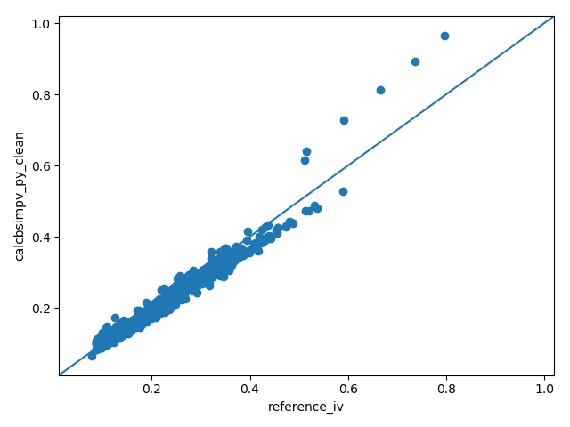
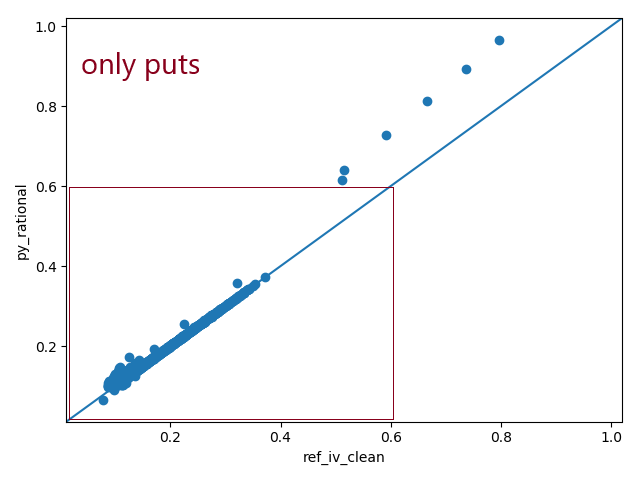

Results and (some) Discussion.
====================================

It was important to me to port the behavior of the ``calcBsImpVol``.
An easy way to get the results visualized without using pytest and simialer
great tools is a unity plot.

The matrices/arrays which contain the values to be compared are flattened
to row vectors and scattered against each other. Any significant deviation will then
stand out from the line created by ``y = x``

Couple of things which are left to point out in relation to Fig. 1, 2, 3 and 4:

Since I can't know the assumptions made for the risk free rate and dividend yield
I had to come up with somewhat reasonable assumptions on my own.
As such, I picked the T-Notes yields corresponding with the options time until expiry as the risk free rate and the
trailing 12m dividend payout as the dividend yield.

Fig 4.1, 4.2 and 4.3 illustrate that deviation is primarily an issue for calls.

bsimpv, calc_ivol  and calcBsImpVol use closed form formulas designed to return
the implied volatility of european options. The reference method however uses
a numerical approach. american style options should generally be more
expensive or equally priced to european style options.

A numerical approach seems to express that better for calls. Hence the
implied volatility is underestimated by closed form approach.

About he puts with ``iVol ~ 0.5``? Tell us.

``reference`` vs ``calcBSImvol()``, ``bsimpv()`` and ``calcbsimpvol()``
""""""""""""""""""""""""""""""""""""""""""""""""""""""""""""""""""""""""

.. figure:: _static/img/mlb_blsimpv_vs_reference.png
    :width: 350px
    :align: center
    :height: 262px
    :alt: mlb_blsimpv_vs_reference
    :figclass: align-center

    Fig. 1 - reference vs results of MATLAB builtin ``blsimpv()``

.. figure:: _static/img/mlb_rational_vs_reference.png
    :width: 350px
    :align: center
    :height: 262px
    :alt: mlb_rational_vs_reference
    :figclass: align-center

    Fig. 2 - reference vs results of MATLAB ``calcBSImpVol()``

.. figure:: _static/img/mlb_rational_vs_reference_cleaned.png
    :width: 350px
    :align: center
    :height: 262px
    :alt: mlb_rational_vs_reference_cleaned
    :figclass: align-center

    Fig. 3 -  reference vs Python ``calcBSImpVol()`` - adjusted for ``NaN``

    Fig. 4 - reference vs Python ``calcbsimpvol()``

    Fig. 4.1 - reference vs Python ``calcbsimpvol()`` - close up

.. figure:: _static/img/calc_ivol_vs_reference_close_up_calls.png
    :width: 350px
    :align: center
    :height: 262px
    :alt: calc_ivol_vs_reference_close_up_calls
    :figclass: align-center

    Fig. 4.2 - reference vs Python ``calcbsimpvol()`` - only calls

    Fig. 4.3 - reference vs Python ``calc_ivol()`` - only puts

``calcBSImvol`` vs ``bsimpv()`` vs ``calc_ivol``
""""""""""""""""""""""""""""""""""""""""""""""""""""""""""""
Fig. 5 shows that  ``calcBSImvol()`` offers an extended calculation range compared to
``bsimpv()``. The ``NaN`` values returned from ``bsimpv()`` were set to ``zero`` in order to create Fig. 5.

Removing the "silent evindence" of ``NaN``s and ``zero``s returns Fig. 6.

Fig. 7 completes the picture.

.. figure:: _static/img/mlb_builtin_vs_matrixwise.png
    :width: 350px
    :align: center
    :height: 262px
    :alt: mlb_builtin_vs_matrixwise
    :figclass: align-center

    Fig. 5 - MATLAB builtin ``blsimpv()`` vs  MATLAB ``calcBSImpVol()``

.. figure:: _static/img/mlb_builtin_vs_matrixwise_cleaned_for_nan_both.png
    :width: 350px
    :align: center
    :height: 262px
    :alt: mlb_builtin_vs_matrixwise_cleaned_for_nan_both
    :figclass: align-center

    Fig. 6 - MATLAB builtin ``blsimpv()`` vs  MATLAB ``calcBSImpVol()`` - adjusted for ``NaN``

.. figure:: _static/img/python_vs_matlab_clean.png
    :width: 350px
    :align: center
    :height: 262px
    :alt: python_vs_matlab_clean
    :figclass: align-center

    Fig. 7 - Python ``calcbsimpvol()`` vs MATLAB ``calcBSImVol()``

